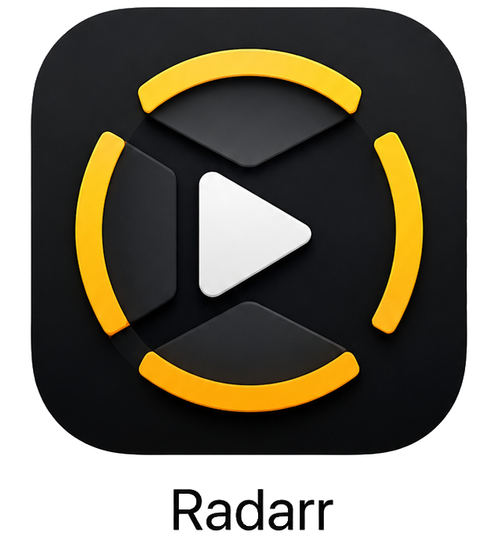

# Radarroid

<p align="center">
  
</p>

<p align="center">
  A native Android TV client for <a href="https://radarr.video/">Radarr</a> — manage your movie library from your couch.
</p>

<p align="center">
  
  
  
  
  
</p>

---

## Features

### Library Management
- **Movies** — Browse your full library with poster art, rating badges, and download status at a glance. Filter by Downloaded / Missing / Monitored / Unmonitored and sort by Title, Year, Added, Rating, or Size
- **Movie Detail** — Full metadata, file details, history log, and interactive release search with one-click grab. Edit monitoring, quality profile, and minimum availability inline
- **Wanted** — Missing movies and cut-off unmet titles in a single tabbed view
- **Collections** — Browse your Radarr movie collections

### Title Finder (TMDB-Powered Discovery)
A fully-featured movie discovery hub powered by The Movie Database API, with 11 browsing modes:

| Mode | Description |
|---|---|
| **Search** | Debounced title search with optional year filter |
| **Trending** | Today's or this week's trending movies |
| **Popular** | All-time most popular titles |
| **Top Rated** | Highest rated movies on TMDB |
| **In Cinemas** | Movies currently in theatres |
| **Upcoming** | Releases coming soon |
| **Discover** | Advanced filter: sort, genre chips (multi-select), year, min rating, min votes, language |
| **By Person** | Search any actor or director and browse their full filmography |
| **By Collection** | Search movie series and franchises (e.g. Marvel, Star Wars) |
| **By Studio** | Search any production company and browse their catalogue |
| **By Keyword** | Search thematic keywords (e.g. heist, time travel, dystopia) |

Each result card shows the TMDB poster, rating, year, and a library badge if already in Radarr. Clicking any movie opens a full detail overlay with cast, crew, budget/revenue, studios, genres, and direct **Add to Radarr** or **View in Library** actions. From the detail view, launch **Similar** or **Recommended** browsing instantly.

### Add Movie
- Search TMDB directly and add movies to Radarr with quality profile, root folder, monitoring, and search-on-add options

### Activity & Downloads
- **Calendar** — Date-based view of upcoming and recently released monitored movies
- **Activity** — Live download queue with queue management and full history log

### Settings
- **Quality Profiles** — View and manage quality tiers and cutoffs
- **Indexers** — Configure NZB and torrent indexers
- **Download Clients** — Manage download applications
- **Import Lists** — Automatic movie addition from external lists
- **Notifications** — Alert and push notification connections
- **Custom Formats** — Advanced quality classification rules
- **Media Management** — Importing, recycling, and file handling rules
- **Naming** — File and folder naming conventions with live preview
- **Tags** — Manage content organisation tags
- **Root Folders** — Add and remove media library locations
- **General (Host)** — URL base, instance name, authentication, and update settings
- **TMDB** — Store your TMDB API access token for Title Finder

### System
- **Status** — Radarr version, paths, OS info, and disk space usage with colour-coded progress bars
- **Tasks** — View and manually trigger all scheduled Radarr tasks
- **Logs** — Paginated log viewer with level colour-coding
- **Health** — Health check overview with wiki links for any issues

---

## Requirements

| Requirement | Detail |
|---|---|
| Android TV | API 21+ (Android 5.0 Lollipop) |
| Radarr | v3 or later (self-hosted) |
| Network | Same LAN or VPN access to your Radarr instance |
| TMDB API Key | Required for Title Finder (free at [themoviedb.org](https://www.themoviedb.org/settings/api)) |

---

## Setup

1. Install the APK on your Android TV device (sideload via ADB or file manager)
2. Open **Radarroid** — you'll be greeted by the setup screen
3. Enter your Radarr server URL, e.g. `http://192.168.1.100:7878`
4. Enter your Radarr API key (found in Radarr → Settings → General)
5. Tap **Connect** — you're in

**Optional:** To enable Title Finder, go to **Settings → TMDB** and enter your TMDB API read access token (v3 auth). Get one free at [themoviedb.org/settings/api](https://www.themoviedb.org/settings/api).

---

## Building from Source

```bash
# Clone the repo
git clone https://github.com/WB2024/Radarroid.git
cd Radarroid

# Build a debug APK
./gradlew assembleDebug

# The APK will be at:
# app/build/outputs/apk/debug/app-debug.apk
```

**Requirements:** Android Studio Hedgehog or later, JDK 17+, Android SDK with API 36.

To install directly to a connected device or emulator:

```bash
adb install -r app/build/outputs/apk/debug/app-debug.apk
```

---

## Tech Stack

| Layer | Technology |
|---|---|
| Language | Kotlin |
| UI | Jetpack Compose + Material 3 |
| Navigation | Jetpack Navigation Compose |
| Networking | Retrofit 2 + OkHttp 3 |
| JSON | Gson |
| Image loading | Coil |
| Radarr API | v3 (full coverage) |
| Movie metadata | TMDB API v3 (Bearer token auth) |
| Min / Target SDK | API 21 / API 36 |
| Build | AGP 8.x, Kotlin 2.0 |

---

## Project Structure

```
app/src/main/java/com/radarrtv/androidtv/
├── data/
│   ├── api/
│   │   ├── model/        # Radarr + TMDB data models
│   │   ├── ApiClient.kt  # Radarr Retrofit client
│   │   ├── RadarrApiService.kt
│   │   ├── TmdbApiClient.kt
│   │   └── TmdbApiService.kt
│   ├── preferences/      # Persistent config (server URL, API keys)
│   └── repository/
│       ├── RadarrRepository.kt
│       └── TmdbRepository.kt
├── ui/
│   ├── components/       # Reusable TV-focused Compose components
│   ├── navigation/       # NavHost and route definitions
│   ├── screens/          # One file per screen
│   │   ├── settings/     # Settings sub-screens
│   │   ├── TitleFinderScreen.kt
│   │   └── TmdbMovieDetailDialog.kt
│   └── theme/            # Colours, typography
└── MainActivity.kt
```

---

## Related

- [Sonarrdoid](https://github.com/WB2024/Sonarrdoid) — the companion app for Sonarr (TV series)
- [Radarr](https://radarr.video/) — the movie collection manager this app connects to
- [TMDB](https://www.themoviedb.org/) — movie metadata and discovery

---

## Disclaimer

This is an unofficial third-party client. It is not affiliated with or endorsed by the Radarr project or The Movie Database (TMDB).
